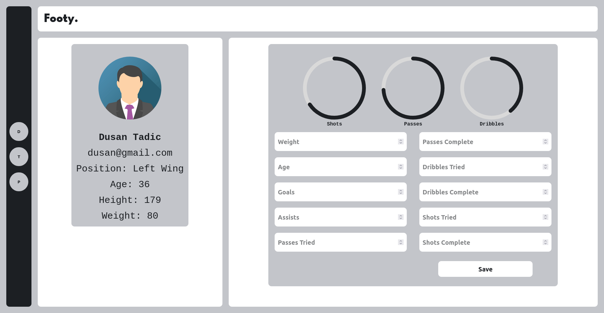
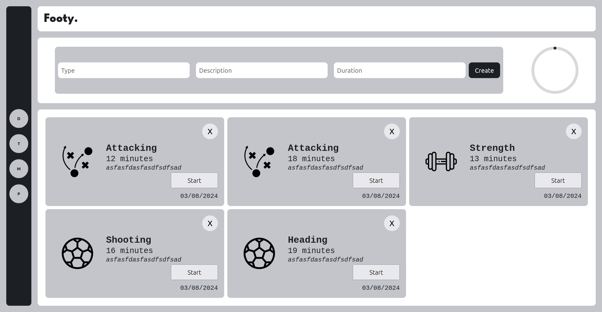
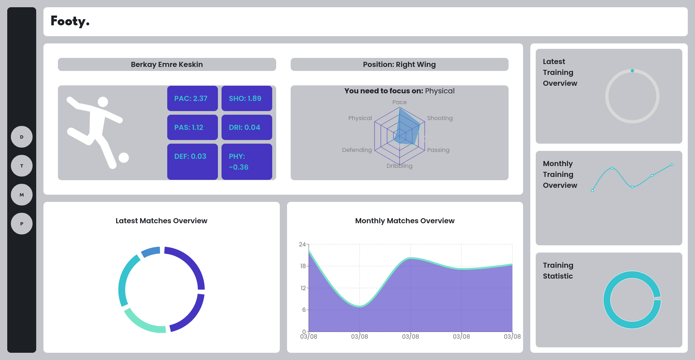

# Footy

## Version 1.0

### Features

1. **User Authentication**
   - User registration
   - User login
   - Email verification

2. **General CRUD Operations**
   - Create, Read, Update, Delete operations for:
     - User profiles
     - Player information
     - Training forms

3. **Player Information**
   - Basic details (name, age, weight etc.)
   - Position-specific attributes (e.g., goals for forwards, assists for midfielders)

4. **Training Forms**
   - Custom training plans based on player position
   - Track training progress
   - Submit training reports

5. **Complete Training Statistics**
   - Aggregate data on training sessions
   - Performance analysis
  

6. **Focus Areas According to Player Statistics**
   - Personalized training recommendations
   - Highlight strengths and areas for improvement

### Implementation Details

1. **Backend**
   - Implement user authentication with JWT
   - Setup CRUD endpoints for user, player information, and training forms with Node.js
   - Use MongoDB for data storage

2. **Frontend**
   - User-friendly forms for registration and login
   - Profile pages displaying player information
   - Dashboard for player statistics
   - Training form submissions and progress tracking

3. **Statistics and Analysis**
   - Generate reports based on player data
   - Provide actionable insights for performance improvement
  
### Tech Stack 
   - Node.js & Express.js for server side development.
   - React.js for frontend development.
   - MongoDB for database.
